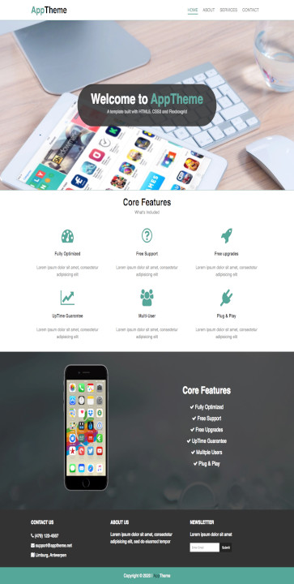

# app-theme
> Code-Along exercise to start using the flexboxgrid.css classes to shape the containers on the webpage using the predefined css classes for different sizes and grids of the layout, a simple example of how to use the font-awesome.css library.

## Table of contents
* [General info](#general-info)
* [Screenshots](#screenshots)
* [Technologies](#technologies)
* [Setup](#setup)
* [Features](#features)
* [Status](#status)
* [Inspiration](#inspiration)
* [Contact](#contact)

## General info
The purpose of the project is to be able to complete a development project using the CVS tool git and the internet service github to store the code remotely. Brief example of how you can make a responsive layout only using CSS code from the flexboxgrid css file, you can shape any kind of grid object and adjust it for several screen sizes at once. [development-strategy.md](./development-strategy.md) file contains the steps used to complete this project, it describes the branches with details about the what is implemented.

## Screenshots

## Technologies
* HTML5
* CSS3
* git
* font-awesome library
* flexboxgrid library

## Setup
You can clone or fork this repository and test the files.

## Features
The project features a web site with:
* Complete basic layout of a company website with related pages: About, Services and Contact.
* Use of the flexgridbox CSS template to shape the containers into grids.
* font-awesome icon library to give a neat look.

## Status
Project is: finished, final version.

## Inspiration
[Responsive Template](https://www.youtube.com/watch?v=qlA7dputiNc) tutorial.

## Contact
Created by [@ferrycosv](www.github.com/ferrycosv) - feel free to contact me!